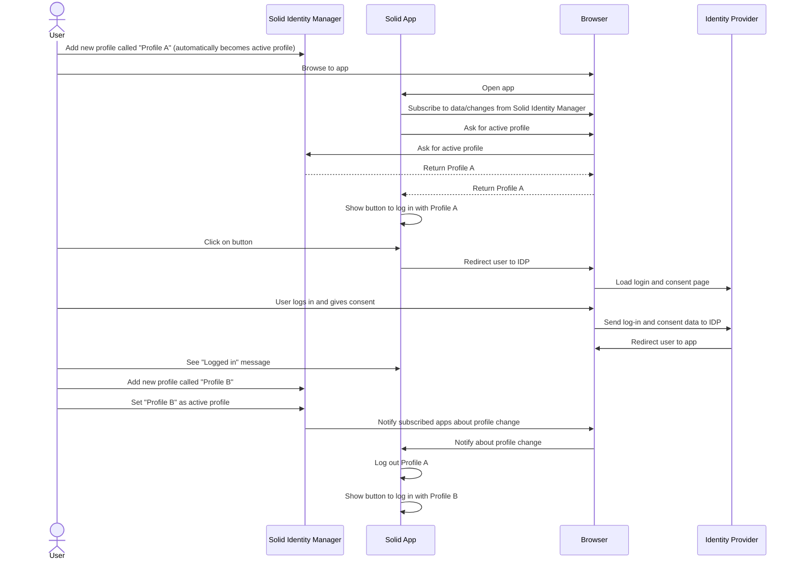

# Solid Identity Extension

This Chrome extension currently acts as a remote control to **manage your Solid identities** and
make it easy for the user to switch between their WebIDs.
The way this works is by giving the user the option to add _profiles_ to the extension which 
it will store to persist over the course of its use.
A profile describes either a WebID or an IDP.
Subsequently, the profile gets a display name and
a color to generate an avatar used to distinguish between other profiles.
Profiles will be listed when clicking on the extension, and
an active profile is shown in the top.

The extension provides an API to a Solid app either through the use of `chrome.runtime.connect` with the extension ID, or
by using a plugin provided by us as an NPM package to make interfacing with the extension. (TODO)
A draft of how this package would work can be found in `./showcase-app/plugin/`.
The idea is for the **Solid app (not part of the extension) to manage the authentication**, and
the extension **only provides a way of keeping track of profiles**.
Previous versions of this extension intercepted or modified network requests, and
due to security concerns, this was not desirable.

## Quickstart

The extension was developed using `node:lts/hydrogen`.
You can use `nvm` to synchronise this for local development.

```shell
npm i
npm start
```

This will start up the build-process with hot-reload.

To add the extension to the browser, navigate to `chrome://extensions/` and click `Load unpacked`.
Navigate and add the `dist/` folder of this project.

Hot-reloading replenishes the files every time you save something in `src/`.
In some cases, mainly when errors occur, you must reload the module in the `chrome://extensions/`.
It should not be removed. You may pin the extension for convenience.

Use the `showcase-app` if you want to try out an example Solid app to test this extension end-to-end.

```shell
cd `./showcase-app`
yarn install
yarn start
```

Navigate to `http://localhost:5173/`.
When the extension is present and has identities,
the option will be shown to continue as the active set profile.

## Testing the flow

In order to full test how this extension works end-to-end, you must take the following steps:

- Follow the steps in [quickstart](#quickstart) to run the extension and the showcase app
- Open the extension and **add a new profile** if you haven't already
- A dialog appears in which you can give the new profile a display and color + add either an IDP or WebID
- Once created, the dialog and extension will close.
When you open the extension again the profile will be in there and selected as active.
- In the Solid showcase app running on `http://localhost:5173/` you find the login widget that
allows you to one-click sign-in with the active profile.
If it is not present (it should),
you can switch profile to trigger updates between the app and the extension.
- After clicking the one-click sign-in button,
you will be redirected to the IDP where you must sign in.
You will be able to authorize the WebID with the Solid showcase app.
- You may then use the logout button to prompt logging out.
When you select another identity in the extension,
you will be automatically logged out.

## Obtaining WebIDs for testing

You can create temporary WebIDs using `https://pod.playground.solidlab.be/idp/register/`.
When creating a new profile you may add `https://pod.playground.solidlab.be` as the IDP, or
the WebID you've obtained after registration.
These are reset daily, so make sure you've recreated it in order for authorization to work.



## Future work and ideas

Currently the extension acts as a remote control for managing profiles.
It can set an active identity, manage existing profiles and modify/delete them.
Profiles simply contain either an IDP or WebID, with an additional display name and color label.
Solid Apps can then get this profile data to effectively log in using these credentials.
There are some limitations in this setup.
We might have to change the way this extension works in order to cater to the needs of its users.

### Distinct profiles per tab

Different solid apps in different parallel tabs might want to use different profiles.
The current logic of having an active profile implies that every app will use the same identity,
which is not necessarily desired behaviour.

### Multiple options

To allow the above condition to be satisfied,
the showcase app in this bundle should allow the user to select which of the stored profiles
they want to use for this specific app in this specific tab.
It's more desirable to have list of available profiles to continue with.

### Session persistence where possible

It's very difficult to let the extension handle login/authorisation for the solid application for security reasons.
Technically this is also challenging because the environment the extension runs in is neither pure Browser nor NodeJS,
making usage of the existing inrupt package difficult and non-standard.
Storing sessions between page refreshes in separate tabs/apps would therefore
ideally be a concern for the solid app and not the extension.
The way the current setup makes this easier,
is by providing an intermediate layer in the form of a package developers can use.

### Ease of access

Ideally the extension solves the problem of convenience.
Having to enter WebIDs again and again everywhere,
especially when developing and testing out different cases with distinct WebIDs & pods.
It is convenient if you can just click and select which profile you'd like to go forward with per tab/app.
For security reasons of course,
first time use of a WebID in a certain app will ask for permissions you will explicitly have to grant.
Also, you will be prompted to sign in with your IDP every time,
but autofill already solves part of that specific inconvenience.

### Multi-session across multiple tabs running the same application

Depending on which app you use, this is possible or not.
An example of an app where this is not possible, is <https://podpro.dev/>.
The documentation at inrupt describes that Session data is actually not stored anywhere clientside, and
every refresh the IDP is consulted to validate the running session.
When you have two tabs with the same app,
it might actually not be possible or easy to have the two sessions in parallel.
Because when you log into another WebID in the other tab, and
refresh the first tab, it will effectively retrieve the latest session.
Storing sessions or tokens in localstorage or anywhere clientside is discouraged for security reasons.
Perhaps with additional research, a workaround can be conceptualized that does not compromise security.

## License

This code is copyrighted by [Ghent University – imec](http://idlab.ugent.be/) and
released under the [MIT license](http://opensource.org/licenses/MIT).
